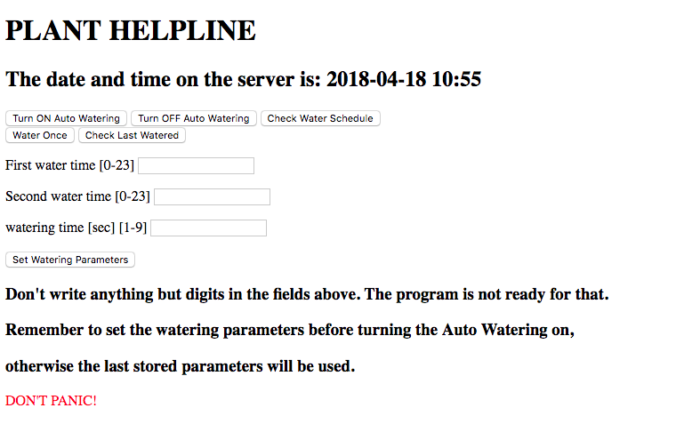

# Raspberry Pi and Arduino Automated Plant Watering with Website

Set up your Pi and Arduinos to automatically take care of house plants!
In this project Pizero W is used to make a website where you can set up set the watering parameters. I set it to water the plants twice a day at desired time for a certain number of seconds [1-9].



## Hardware components

* Raspberry Pi Zero W

* Arduino Uno x2
* Bluetooth module H5-05 x2
* 128x64 OLED display
* Relay module
* Submersible Pump
* Soil moisture sensors x5

### Wiring to the first arduino

* OLED screen:
  * OLED GND pin to ground
  * OLED VCC to 5V
  * OLED SCL pin to A5
  * OLED SDA pin to A4
  * Check this nice To learn how to setup an OLED display and install useful libraries: [OLED tutorial](http://www.instructables.com/id/Monochrome-096-i2c-OLED-display-with-arduino-SSD13/ )


* Bluetooth Module:
  * bluetooth rx pin to digital pin 8
  * bluetooth tx pin to digital pin 9

* Relay:
  * relay pin to digital pin 7
  * the power supply of the submersible pump must be connected to this relay

* DS3231 Clock
  * GND to ground
  * Vcc to 5V
  * SCL to SCL in arduino
  * SDA to SDA in arduino

### Wiring to the second arduino

* Bluetooth Module:
* bluetooth rx pin to digital pin 8
* bluetooth tx pin to digital pin 9

*Soil moisture sensors:
*to analog pin A0,A1,A2,A3,A4


## Prerequisites

* Raspberrypi zero w with [Jessie](https://www.raspberrypi.org/blog/raspbian-jessie-is-here/).


* Python 2.7
  * datetime
  * time
  * bluetooth
  * apscheduler
  * json
  * flask
  * psutil
  * os
  * json
  * time


## Software

There are three parts to this setup. Two files are the arduino sketches, and the other runs a local web server, and some files are used to store data.
* Arduino
    * *arduino_water_bt.ino* this is the arduino sketch. At the first setup uncomment line 102 (//setDS3231time(00,42,17,2,28,05,18);) and set the proper time and upload the code in arduino. Then comment line 102 again and upload the code in arduino again. This way the DS3231 module will remember the real time even if disocnnected from power (the DS3231 module has an external battery), and when connected again to power it will not set up the time again. Arduino will check wether there is an incoming data from bluetooth.  If it receives something there are four possibilities:
        * "w" it activates the pump for a certain amount of seconds, default is 8.
        * "h" it waits for the next command
        * "0-9" if it receives a number between 0 and 9 it changes the watering time to that value
        * if any other string or value is received it does nothing
* Arduino
        * *arduino_soil_sensor.ino* this is the arduino sketch for the second arduino. It continuosly check the output value of the sensors and sends it via bluetooth to Pi.
* Webserver
    * *auto_water.py* this file, when executed, it starts the auto watering process
    * *water.py* contains the functions called by the webserver.
    * *web_plants.py* this is the python script that runs the webserver.
    * *templates/main.html* the template for the webserver.
* Data Storage
    * *last_watered.txt* contains the list of dates and times when the plants were watered.
    * *next_water.txt* contains the current watering schedule.
    * *watering_parameters.txt* contains the watering parameters saved as a dictionary

### Flask Webserver
The template for the Webserver is defined in *main.html*, that must be in a subfolder called templates. Before starting the webserver change the bluetooth addresses with your corresponding address in *water.py*. The port should not be changed.
```
#bluetooth address of the arduino
#controlling the pump
bd_addr = "XX:XX:XX:XX:XX:XX"
port = 1
#bluetooth address of the arduino
#controlling the soil moisture sensors
bd_addr2 = "XX:XX:XX:XX:XX:XX"
port2 = 1
```
To start the webserver run the following command:
```
sudo python web_plants.py
```
Now if you navigate to the ip address of your Pi on port 12345 you should see a web dashboard. To change the port modifiy the port number on the last line of *web_plants.py*
```
if __name__ == "__main__":
    app.run(host='0.0.0.0', port=12345, debug=True)
```

### Run Webserver automatically
To auto start the webserver when Pi gets turned on a tool called cronjob can be used:
```
sudo crontab -e
```
In the text editor add the following line and make sure to leave an empty line below
```
@reboot cd <your path to web_plants>; sudo python web_plants.py


```


## License


## Acknowledgments

The project was inspired by this post in [hackster.io](https://www.hackster.io/ben-eagan/raspberry-pi-automated-plant-watering-with-website-8af2dc)
